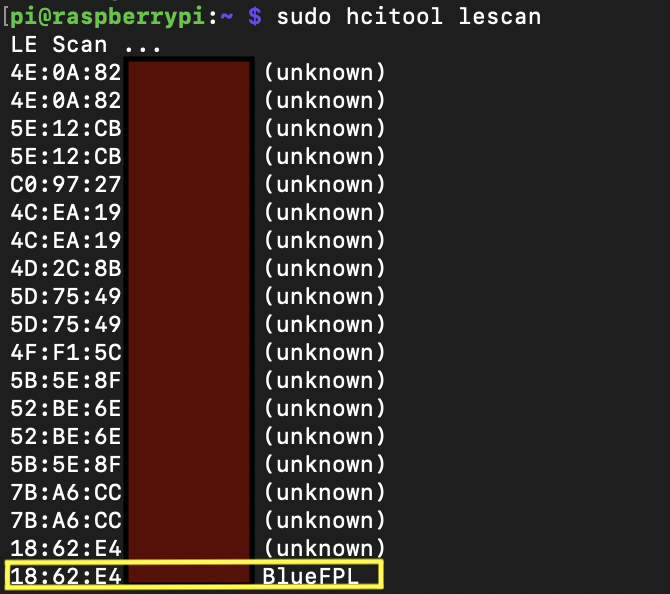

# Remote Attack Scenario
In this scenario, a remote attacker acquires sensitive user info from arbitrary users, unbinds their locks, and binds them to the attacker's account. Such a scenario would provide ample opportunity for successful large-scale phishing/malspam attacks against OKLOK users because the attacker would be in possession of user account information that he/she could utilize in the email to make it seem more legitimate. The attacker could also use the fact that the lock has indeed been bound to another account as a pretext to convince users that urgent action is required. Additionally, this scenario would give an attacker a list of email addresses and unsalted MD5 password hashes, many of which could be cracked. The attacker in this scenario would likely target more than one user account at a time.

## attack_scenario_remote.py
>The attack_scenario_remote.py script obtains user account information, unbinds the lock from the victim user, binds the lock to the attacker's user account, and creates a csv file called 'userdata.csv', which contains the email address, lock name, fingerprint name, and barcode of the victim account. The 'userdata.csv' file is a sample of items that an attacker could include in a phishing/malspam email to reassure the victim that the email is legitimate. This script targets only one user account at a time.

# Physically Proximate Attack Scenario
In this scenario, a physically proximate attacker unbinds a lock from a victim account, binds the lock to the attacker's account, unlocks the lock, and retrieves the user account information associated with the lock. In many instances, the unsalted MD5 hash could be cracked. Otherwise, the attacker could attempt to brute force the account with the email address that was found. Like in the remote scenario, the attacker would also be poised to send a convincing phishing/malspam email to the user to inflict further damage. The attacker in this scenario would likely target one user at a time.

## attack_scenario_proximate.py
>The attack_scenario_proximate.py script unbinds the lock from the victim account and binds it to the attacker's account, giving the attacker the ability to unlock the lock. It then prints user account info. The script requires the MAC address of the targeted lock and assumes the attacker is in physical proximity to the lock.

# Usage
```python3 attack_scenario_remote.py <victim_userID> <attacker_email_address>```

`<victim_userID>` = the userID of the victim account <br/>
`<attacker_email_address>` = the email address of the attacker account to which the lock will be bound (account will also be used to generate an accepted token for the HTTP headers)

```python3 attack_scenario_proximate.py <victim_mac> <attacker_email_address>```

`<victim_mac>` = the MAC address of the lock <br/>
`<attacker_email_address>` = the email address of the attacker account to which the lock will be bound (account will also be used to generate an accepted token for the HTTP headers)

**DISCLAIMER:** Use these scripts only against userIDs and device MAC addresses that you own. To check your userIDs, use the check_userID.py script in the 'extras' folder of this repo, or run the OKLOK mobile app through a proxy and observe the userID transmitted in the web requests. To check your MAC address, use hcitool or a similar BLE-compatible tool. 

# Demos

Proximate
---------
To use attack_scenario_proximate.py, first get the device MAC address of the target device in range.



Then, run the script against the MAC address. 


