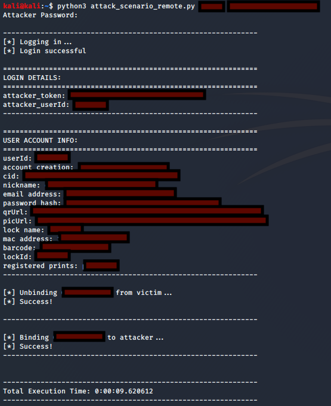
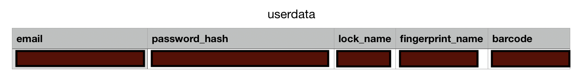
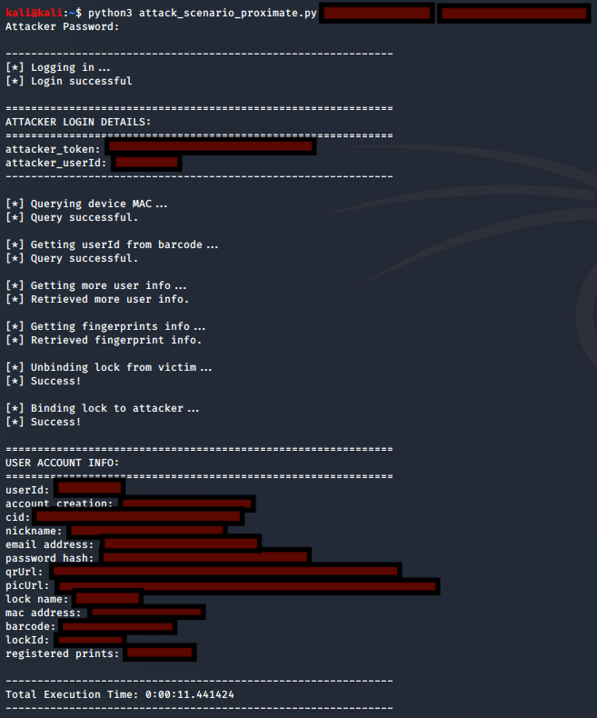

# Remote Attack Scenario
In this scenario, a remote attacker is able to acquire sensitive user info from arbitrary users, unbinds their locks, and binds them to the attacker's account. Such a scenario would then provide ample opportunity for successful large-scale phishing/malspam attacks against OKLOK users because the attacker would be in possession of user account information that he/she could utilize in the email to make it seem more legitimate. The attacker could also use the fact that the lock has indeed been bound to another account as a pretext to convince users that urgent action is required. Additionally, this scenario would give an attacker a list of email addresses and corresponding unsalted MD5 password hashes, many of which could be cracked and used in credential stuffing attacks against other services. The attacker in this remote scenario would likely target a large range of victims at once. An attacker would not need prior knowledge of victim accounts, and would only need to supply a range of random userIDs to a succession of API calls, using their own authorization token, in order to achieve this remote attack scenario.

# Physically Proximate Attack Scenario
In this scenario, a physically proximate attacker unbinds a lock from a victim account, binds the lock to the attacker's account, unlocks the lock, and retrieves the user account information associated with the lock. In many instances, the unsalted MD5 hash could be cracked and used for credential stuffing against other services. Otherwise, the attacker could attempt to brute force the account with the email address that was found. Like in the remote scenario, the attacker would also be poised to send a convincing phishing/malspam email to the user to inflict further damage. The attacker in this physically proximate scenario would likely target one user at a time. The attacker would not need prior knowledge of victim accounts. They would need to scan for the MAC address and use it to initiate a succession of API calls to achieve this physically proximate attack scenario.

# Demos
Details are redacted in the demos. 

### Remote
The attack_scenario_remote.py script runs as shown below. 

The userdata.csv file is created in the same directory as the script.

### Proximate
To use attack_scenario_proximate.py, first get the device MAC address of the target device in range.

Then, run the script against the MAC address. 

# Acknowledgements
Both scenarios took inspiration from the PoC [here](https://github.com/securelayer7/pwnfb50/blob/master/pwnfb50.py), which unbinds a victim lock and binds it to an attacker account. See Acknowledgements section on the root README.md.

