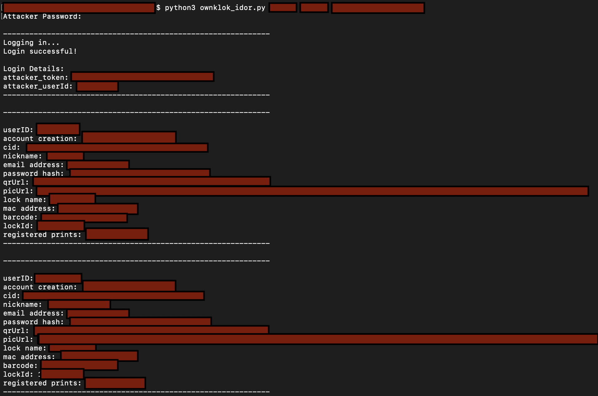

# CVE-2020-8791
>The OKLOK (3.1.1) mobile companion app for Fingerprint Bluetooth Padlock FB50 (2.3) allows remote attackers to submit API requests using authenticated but unauthorized tokens, resulting in IDOR issues. A remote attacker can use their own token to make unauthorized API requests on behalf of arbitrary user IDs. Valid and current user IDs are trivial to guess because of the user ID assignment convention used by the app. A remote attacker could harvest email addresses, unsalted MD5 password hashes, owner-assigned lock names, and owner-assigned fingerprint names for any range of arbitrary user IDs.

### ownklok_idor
> Obtain user account details such as email address, unsalted MD5 password hash, lock name, and fingerprint name, for users of the OKLOK (3.1.1) mobile companion app for Fingerprint Bluetooth Padlock FB50 (2.3).

### Usage
```python3 ownklok_idor.py <start_of_range> <end_of_range> <attacker_email_address>```

`<start_of_range>` = the first victim userID in the range <br/>
`<end_of_range>` = the upper bound of the victim userID range, non-inclusive (last userID + 1) <br/>
`<attacker_email_address>` = the email address of the attacker account, which will be used to generate an accepted token for the HTTP headers

### Demo
The demo below shows ownklok_idor.py in action. All sensitive info has been redacted. The example below runs through two consecutive userIDs, which were specified by <start_of_range> <end_of_range>. 

**DISCLAIMER:** Use this script only against userIDs that you own. To check your userIDs, you may want to run the OKLOK mobile app through a proxy, such as Fiddler, and observe the userID transmitted in the web requests (do this for each account you register). If you do not own consecutive userIDs, do not include additional userIDs in the script range arguments, and instead run the tests separately per userID (e.g., `python3 ownklok_idor.py <userID1> <userID1_+1> <attacker_email_address>` <br/> `python3 ownklok_idor.py <userID2> <userID2_+1> <attacker_email_address>`)


